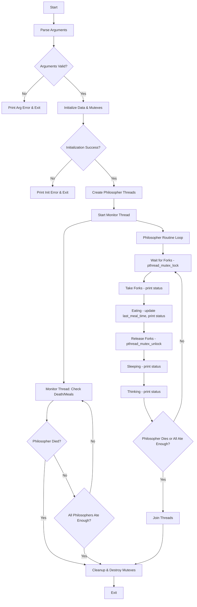

```mermaid
flowchart TD
	A[Start] --> B[Parse Arguments]
	B --> B1{Arguments Valid?}
	B1 -- No --> E1[Print Arg Error & Exit]
	B1 -- Yes --> C[Initialize Data & Mutexes]
	C --> D{Initialization Success?}
	D -- No --> E[Print Init Error & Exit]
	D -- Yes --> F[Create Philosopher Threads]
	F --> G[Start Monitor Thread]
	G --> MT[Monitor Thread: Check Death/Meals]
	MT --> MT1{Philosopher Died?}
	MT1 -- Yes --> J[Signal Stop & Cleanup]
	MT1 -- No --> MT2{All Philosophers Ate Enough?}
	MT2 -- Yes --> J[Signal Stop & Cleanup]
	MT2 -- No --> MT
	G --> H[Philosopher Routine Loop]
	H --> H1[Wait for Forks - pthread_mutex_lock]
	H1 --> H2[Take Forks - print status]
	H2 --> H3[Eating - update last_meal_time, print status]
	H3 --> H4[Release Forks - pthread_mutex_unlock]
	H4 --> H5[Sleeping - print status]
	H5 --> H6[Thinking - print status]
	H6 --> I{Philosopher Dies or All Ate Enough?}
	I -- No --> H1
	I -- Yes --> TJ[Join Threads]
	TJ --> J[Cleanup & Destroy Mutexes]
	J --> K[Exit]
```
