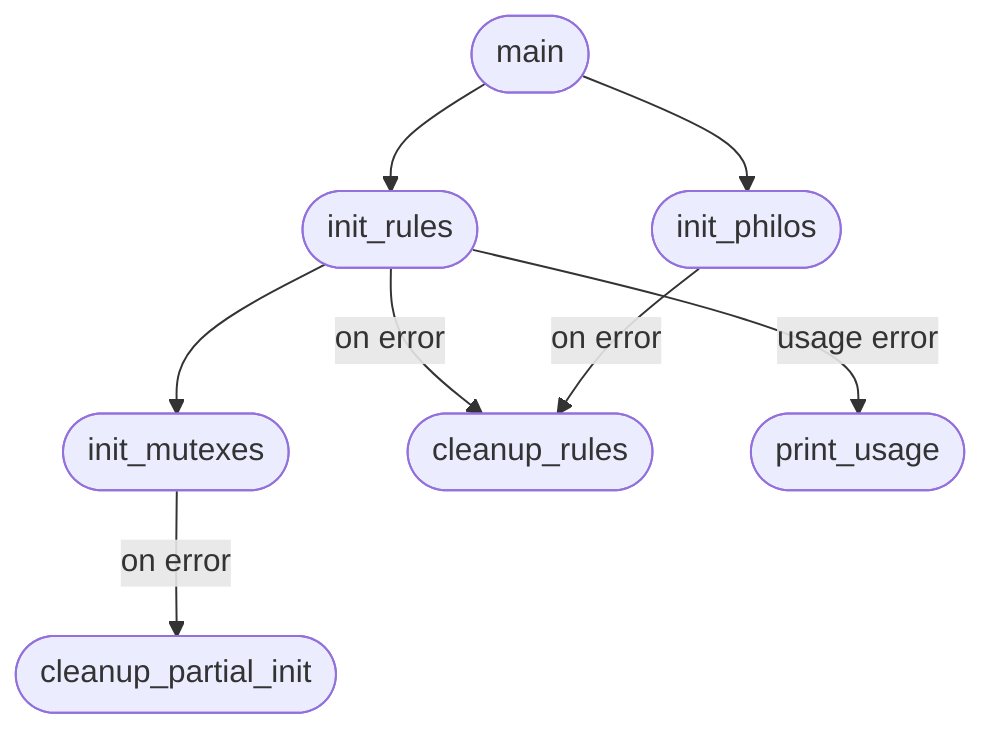
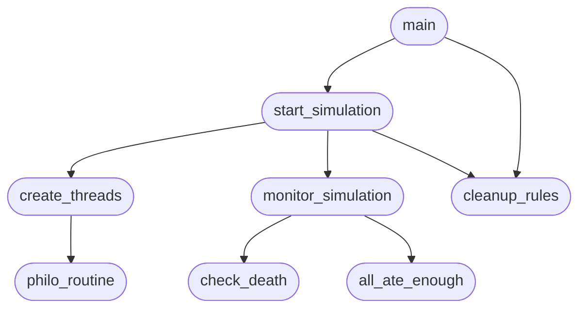
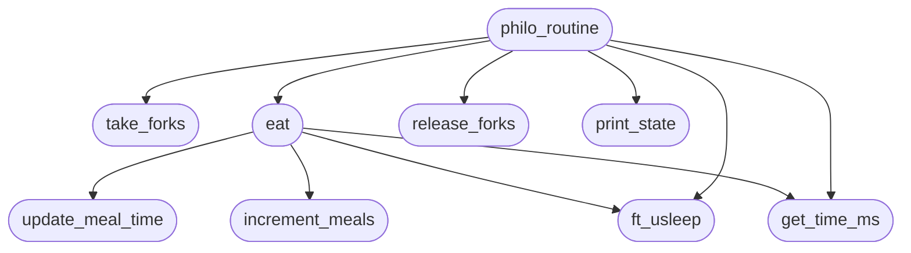
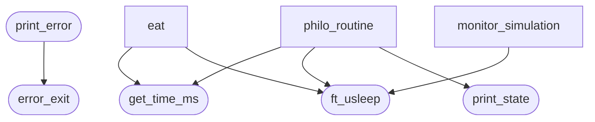
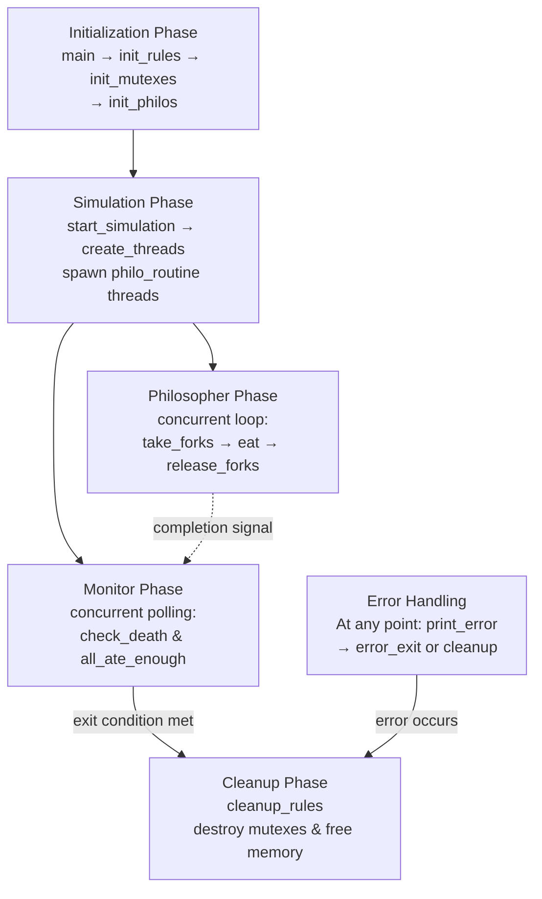

# Main Function Relationships in philo (Section Flow Diagrams)

## 1. Initialization & Setup Flow

**Details:**
- `main` initializes rules, mutexes, and philosophers sequentially
- `init_rules` calls `init_mutexes` internally
- Errors trigger partial or full cleanup
- Usage errors display help message via `print_usage`

---

## 2. Simulation & Monitoring Flow

**Details:**
- `start_simulation` creates philosopher threads and manages the monitor
- Philosopher threads run concurrent `philo_routine` loops
- Main thread runs `monitor_simulation` to check for death and completion conditions
- Monitor polls `check_death` and `all_ate_enough` in a loop
- After simulation completes, full cleanup occurs

---

## 3. Philosopher Routine Flow

**Details:**
- `philo_routine` is the main loop for each philosopher thread
- Philosophers take forks, eat, update meal info, print state, then sleep
- `take_forks` and `release_forks` manage fork mutual exclusion
- `update_meal_time` and `increment_meals` track dining history
- `print_state` outputs philosopher actions
- `ft_usleep` is used for sleeping, which checks stop condition

---

## 4. Utility & Error Handling Flow

**Details:**
- `get_time_ms()` provides current time in milliseconds for meal tracking
- `ft_usleep()` sleeps while respecting stop condition (allows early termination)
- `print_state()` outputs philosopher state changes with thread-safe printing
- `print_error()` logs errors to stderr
- `error_exit()` returns error code after printing error message
- Utilities are used throughout philosopher routine and monitor sections

---

## 5. Complete Execution Flow

**Details:**
- **Initialization Phase:** Validate arguments and setup data structures
- **Simulation Phase:** Create philosopher threads and start main monitor
- **Philosopher Phase:** Concurrent eating-thinking cycle with fork management
- **Monitor Phase:** Main thread checks for death or completion
- **Cleanup Phase:** Destroy all synchronization primitives and free memory
- **Error Handling:** Any error triggers appropriate cleanup and logging

