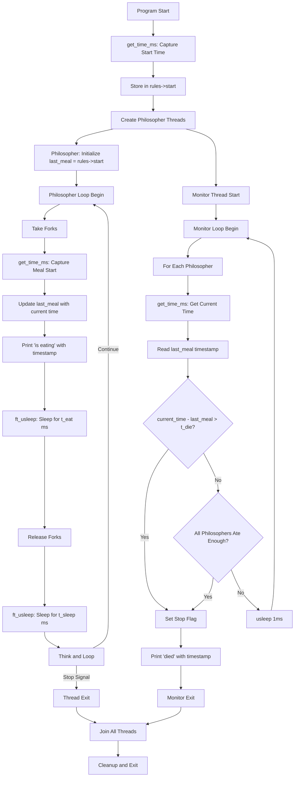

# Time Management Flow in Philosophers (philo)

## Overview

Time management is critical in the Philosophers project for detecting philosopher deaths, coordinating actions, and ensuring proper simulation timing. This document explains how time is tracked, used, and managed throughout the simulation.

## Core Time Management Functions

### 1. `get_time_ms()` - Current Time Retrieval

**Location:** `philo/src/time.c`

```c
long	get_time_ms(void)
{
	struct timeval	tv;

	gettimeofday(&tv, NULL);
	return ((tv.tv_sec * 1000) + ((tv.tv_usec + 500) / 1000));
}
```

**Purpose:**
- Returns the current time in milliseconds since Unix epoch
- Uses `gettimeofday()` system call for microsecond precision
- Converts time to milliseconds for easier timestamp calculations
- Adds 500 microseconds for rounding to nearest millisecond

**Usage Throughout Codebase:**
- **Simulation Start:** Records the start time in `rules->start`
- **Meal Tracking:** Captures timestamp when philosopher begins eating
- **Death Detection:** Gets current time to compare against last meal time
- **Timestamp Printing:** Calculates elapsed time for console output

---

### 2. `ft_usleep()` - Precise Sleep Function

**Location:** `philo/src/time.c`

```c
void	ft_usleep(t_rules *rules, long ms)
{
	long	start;
	long	now;
	long	remaining;

	start = get_time_ms();
	while (!get_stop(rules))
	{
		now = get_time_ms();
		if (now - start >= ms)
			break ;
		remaining = ms - (now - start);
		if (remaining > 1)
			usleep((remaining / 2) * 1000);
		else
			usleep(100);
	}
}
```

**Purpose:**
- Custom sleep function that respects stop conditions
- More accurate than standard `usleep()` for longer durations
- Allows early exit when simulation stop flag is set

**Algorithm:**
1. **Record Start Time:** Captures the initial timestamp
2. **Loop Until Duration Met:** Continuously checks elapsed time
3. **Check Stop Condition:** Exits early if `get_stop(rules)` is true
4. **Adaptive Sleeping:**
   - If remaining time > 1ms: Sleep for half the remaining time
   - If remaining time ≤ 1ms: Sleep for 100 microseconds (busy-wait)
5. **Precision:** Uses smaller sleep intervals as deadline approaches

**Advantages Over Standard `usleep()`:**
- **Interruptible:** Can stop immediately when simulation ends
- **More Accurate:** Compensates for system scheduling delays
- **Prevents Oversleeping:** Checks time repeatedly to hit target precisely

---

## Time Management Flow Diagram



---

## Time Usage Throughout Simulation

### 1. Initialization Phase

**File:** `philo/src/start.c`

```c
int	start_simulation(t_rules *rules)
{
	// ...
	rules->start = get_time_ms();  // Capture simulation start time
	threads_created = create_threads(rules);
	// ...
}
```

**What Happens:**
- Captures the simulation start time before creating threads
- Stores in `rules->start` as reference point for all timestamps
- All philosopher threads use this as their initial `last_meal` time

**File:** `philo/src/start.c` (in `create_threads`)

```c
pthread_mutex_lock(&rules->philos[philo_idx].meal_mutex);
rules->philos[philo_idx].last_meal = rules->start;
pthread_mutex_unlock(&rules->philos[philo_idx].meal_mutex);
```

**What Happens:**
- Each philosopher's `last_meal` is initialized to simulation start time
- Ensures no false death detection at the beginning
- Protected by mutex to prevent race conditions

---

### 2. Eating Phase

**File:** `philo/src/meal.c`

```c
void	eat(t_philo *philo)
{
	long	now;

	now = get_time_ms();           // Capture current time
	update_meal_time(philo, now);  // Update last_meal
	print_state(philo, "is eating", 0);
	ft_usleep(philo->rules, philo->rules->t_eat);  // Sleep for eating duration
	increment_meals(philo);
}
```

**Time Flow:**
1. **Capture Timestamp:** `get_time_ms()` gets current time when eating begins
2. **Update Last Meal:** Stores timestamp in philosopher's `last_meal` field
3. **Print State:** Outputs eating message with elapsed time since start
4. **Sleep Duration:** Uses `ft_usleep()` to simulate eating time
5. **Increment Counter:** Tracks number of meals eaten

**File:** `philo/src/meal.c` (in `update_meal_time`)

```c
void	update_meal_time(t_philo *philo, long now)
{
	pthread_mutex_lock(&philo->meal_mutex);
	philo->last_meal = now;
	pthread_mutex_unlock(&philo->meal_mutex);
}
```

**Thread Safety:**
- `last_meal` is protected by `meal_mutex`
- Prevents race conditions between philosopher and monitor threads
- Ensures monitor reads consistent timestamp

---

### 3. Sleeping & Thinking Phase

**File:** `philo/src/routine.c`

```c
static void	philo_sleep(t_philo *philo)
{
	print_state(philo, "is sleeping", 0);
	ft_usleep(philo->rules, philo->rules->t_sleep);  // Sleep respecting stop flag
}

static void	philo_think(t_philo *philo)
{
	long	think_time;

	print_state(philo, "is thinking", 0);
	if (philo->rules->num % 2 == 1)
	{
		think_time = philo->rules->t_die - (philo->rules->t_eat
				+ philo->rules->t_sleep);
		if (think_time > 0)
			ft_usleep(philo->rules, think_time / 2);  // Adaptive thinking
	}
}
```

**Time Management:**
- **Sleeping:** Uses `ft_usleep()` for accurate sleep duration
- **Thinking:** Calculates think time based on death timer and action durations
- **Odd Number Optimization:** For odd philosopher counts, adds strategic thinking delay
- **Prevents Starvation:** Helps balance fork access among philosophers

---

### 4. Death Detection (Monitor Thread)

**File:** `philo/src/monitor.c`

```c
static int	check_death(t_rules *rules)
{
	int		philo_idx;
	long	current_time;
	long	last_meal_time;

	philo_idx = 0;
	while (philo_idx < rules->num)
	{
		pthread_mutex_lock(&rules->philos[philo_idx].meal_mutex);
		last_meal_time = rules->philos[philo_idx].last_meal;
		pthread_mutex_unlock(&rules->philos[philo_idx].meal_mutex);
		if (last_meal_time < 0)
		{
			philo_idx++;
			continue ;
		}
		current_time = get_time_ms();  // Get current timestamp
		if (current_time - last_meal_time > rules->t_die)  // Death check
		{
			set_stop(rules);
			print_state(&rules->philos[philo_idx], "died", 1);
			return (1);
		}
		philo_idx++;
	}
	return (0);
}
```

**Death Detection Algorithm:**
1. **Iterate Through Philosophers:** Check each philosopher sequentially
2. **Read Last Meal:** Safely retrieve `last_meal` timestamp (mutex-protected)
3. **Get Current Time:** Call `get_time_ms()` for comparison
4. **Calculate Elapsed Time:** `current_time - last_meal_time`
5. **Death Condition:** If elapsed time exceeds `t_die`, philosopher has died
6. **Stop Simulation:** Set global stop flag and print death message

**Monitor Loop:**
```c
void	monitor_simulation(t_rules *rules)
{
	while (!get_stop(rules))
	{
		if (check_death(rules))
			return ;
		if (all_ate_enough(rules))
		{
			set_stop(rules);
			return ;
		}
		usleep(1000);  // Check every 1ms
	}
}
```

**Monitoring Strategy:**
- Checks for death every 1 millisecond (1000 microseconds)
- Fast enough to detect deaths within acceptable margin
- Avoids excessive CPU usage with 1ms sleep interval

---

### 5. Timestamp Printing

**File:** `philo/src/print.c`

```c
void	print_state(t_philo *philo, char *msg, int force)
{
	long	timestamp;

	pthread_mutex_lock(&philo->rules->print_mutex);
	if (!get_stop(philo->rules) || force)
	{
		timestamp = get_time_ms() - philo->rules->start;  // Calculate elapsed time
		printf("%ld %d %s\n", timestamp, philo->id, msg);
	}
	pthread_mutex_unlock(&philo->rules->print_mutex);
}
```

**Timestamp Calculation:**
- **Elapsed Time:** `get_time_ms() - rules->start`
- **Relative Timestamp:** Shows milliseconds since simulation start
- **User-Friendly:** Makes output easier to read than absolute Unix timestamps
- **Thread-Safe:** Protected by `print_mutex` to prevent interleaved output

**Output Format:**
```
[elapsed_ms] [philosopher_id] [action]
```

**Example Output:**
```
0 1 has taken a fork
0 1 has taken a fork
0 1 is eating
200 1 is sleeping
400 1 is thinking
400 2 has taken a fork
400 2 has taken a fork
400 2 is eating
600 2 is sleeping
```

---

## Critical Time Management Concepts

### 1. Precision vs Performance Trade-off

**Why Not Use Standard `sleep()` or `usleep()`?**

Standard sleep functions have issues:
- **Cannot be Interrupted:** Won't respect stop flag
- **Imprecise:** May oversleep due to scheduler granularity
- **No Early Exit:** Wastes time after simulation ends

**Custom `ft_usleep()` Advantages:**
- Checks stop condition on every iteration
- Adjusts sleep duration dynamically
- Achieves millisecond-level accuracy

### 2. Race Condition Prevention

**Time-Related Race Conditions:**
1. **Reading `last_meal` During Update:** Solved with `meal_mutex`
2. **Printing While Another Thread Prints:** Solved with `print_mutex`
3. **Checking Stop Flag Simultaneously:** Solved with `stop_mutex`

**Thread-Safe Time Access:**
```c
// CORRECT: Protected read
pthread_mutex_lock(&philo->meal_mutex);
last_meal_time = philo->last_meal;
pthread_mutex_unlock(&philo->meal_mutex);

// WRONG: Unprotected read (race condition!)
last_meal_time = philo->last_meal;
```

### 3. Time Synchronization Strategy

**Initialization:**
- All philosophers start with `last_meal = rules->start`
- Guarantees no philosopher is considered "starving" at start
- Provides consistent reference point

**Update Points:**
- `last_meal` updated ONLY when eating begins
- Not updated during sleeping or thinking
- Creates accurate death detection window

### 4. Death Detection Precision

**Timing Considerations:**
```
time_to_die = 800ms
time_to_eat = 200ms
time_to_sleep = 200ms

Timeline:
t=0ms:    Philosopher eats (last_meal = 0)
t=200ms:  Philosopher sleeps
t=400ms:  Philosopher thinks
t=600ms:  Philosopher waits for forks
t=800ms:  Monitor detects death (800 - 0 > 800 is FALSE)
t=801ms:  Monitor detects death (801 - 0 > 800 is TRUE) ⚠️
```

**Why 1ms Monitor Interval?**
- Detects death within 1-2ms of actual death time
- Balances accuracy with CPU usage
- Acceptable margin for educational project

---

## Time Management Best Practices

### 1. Always Use `ft_usleep()` Instead of `usleep()`

**Bad:**
```c
usleep(philo->rules->t_eat * 1000);  // Won't respect stop flag
```

**Good:**
```c
ft_usleep(philo->rules, philo->rules->t_eat);  // Respects stop flag
```

### 2. Capture Time Once Per Operation

**Bad:**
```c
update_meal_time(philo, get_time_ms());
print_state(philo, "is eating", 0);  // Different timestamp!
```

**Good:**
```c
now = get_time_ms();
update_meal_time(philo, now);
print_state(philo, "is eating", 0);  // Same timestamp
```

### 3. Protect Time-Sensitive Data with Mutexes

**Critical Fields:**
- `last_meal`: Protected by `meal_mutex`
- `meals`: Protected by `meal_mutex`
- `stop`: Protected by `stop_mutex`

### 4. Calculate Elapsed Time Consistently

**Formula:**
```c
elapsed_ms = get_time_ms() - rules->start;
```

**Always use the same reference point (`rules->start`) for consistency**

---

## Common Time-Related Issues

### Issue 1: False Death Detection at Start

**Problem:** Philosopher dies immediately when simulation starts

**Cause:** `last_meal` not initialized properly

**Solution:**
```c
// In create_threads:
rules->philos[philo_idx].last_meal = rules->start;
```

### Issue 2: Death Detected Too Late

**Problem:** Death message appears several milliseconds late

**Cause:** Monitor check interval too long (e.g., 10ms)

**Solution:**
```c
// In monitor_simulation:
usleep(1000);  // Check every 1ms, not 10ms
```

### Issue 3: Philosophers Don't Stop After Death

**Problem:** Actions continue printing after death message

**Cause:** `ft_usleep()` not checking stop flag properly

**Solution:** Ensure `ft_usleep()` loop condition is `!get_stop(rules)`

### Issue 4: Time Overflow

**Problem:** Negative timestamps after long simulation

**Cause:** `long` overflow after ~24 days of milliseconds

**Solution:** Not a practical concern for this project (simulations are short)

---

## Performance Considerations

### 1. `get_time_ms()` Call Frequency

**Calls Per Second (4 philosophers, 200ms actions):**
- Philosophers: ~20 calls/second (4 philos × 5 events/cycle)
- Monitor: ~1000 calls/second (checking every 1ms)
- Printing: ~20 calls/second

**Total:** ~1040 system calls per second (negligible overhead)

### 2. `ft_usleep()` CPU Usage

**Busy-Wait Last Millisecond:**
- When `remaining ≤ 1ms`, uses 100μs sleep intervals
- Increases CPU usage slightly but improves precision
- Trade-off: <1% CPU for better timing accuracy

### 3. Monitor Polling Overhead

**1ms Polling Interval:**
- Each check: read timestamps, compare values
- Minimal CPU impact (~0.1% per philosopher)
- Alternative (signals) would be more complex and error-prone

---

## Summary

Time management in the Philosophers project is built on two key functions:

1. **`get_time_ms()`:** Provides millisecond-precision timestamps
2. **`ft_usleep()`:** Enables precise, interruptible sleeping

These functions enable:
- **Accurate death detection** within 1-2ms margin
- **Synchronized simulation start** for all philosophers
- **Precise action timing** (eating, sleeping, thinking)
- **Clean simulation shutdown** via stop flag checking
- **Thread-safe timestamp access** via mutexes

The time management system balances precision, performance, and simplicity to create a reliable concurrent simulation.

---

## Related Files

- `philo/src/time.c` - Time utility functions
- `philo/src/meal.c` - Eating and timestamp updates
- `philo/src/monitor.c` - Death detection logic
- `philo/src/routine.c` - Philosopher lifecycle timing
- `philo/src/start.c` - Simulation start time capture
- `philo/src/print.c` - Timestamp printing

---

## See Also

- [Philosopher Section Flows](philo_section_flows.md)
- [Main Data Flow Diagram](../philosophers_FD.md)
- [Mutex Documentation](philo_mutex.md)
