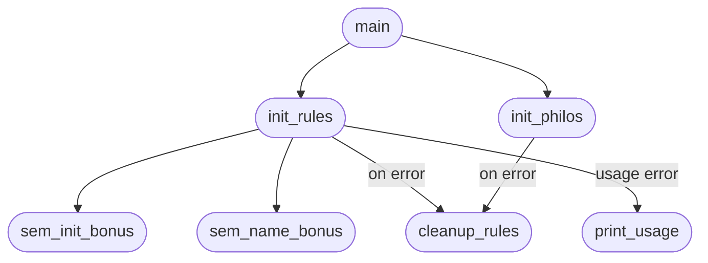
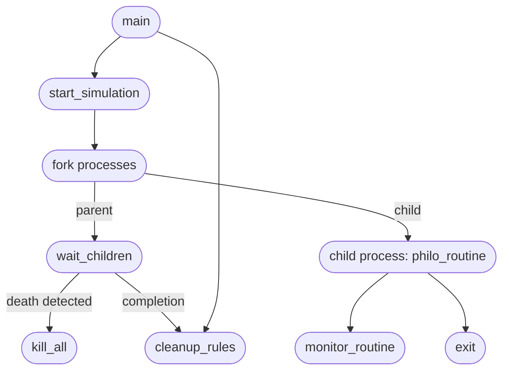
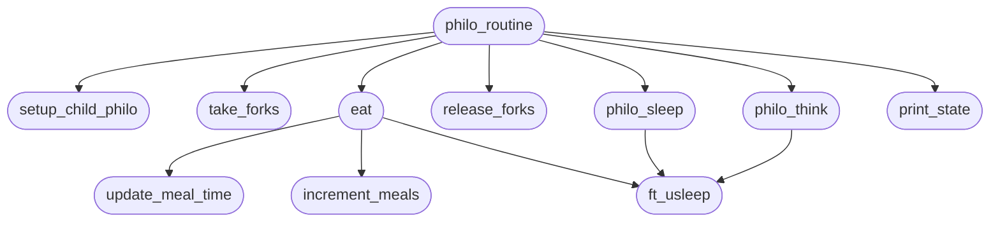
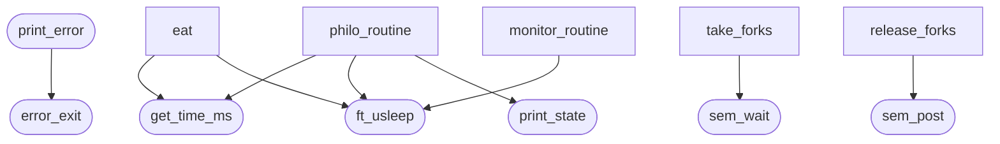
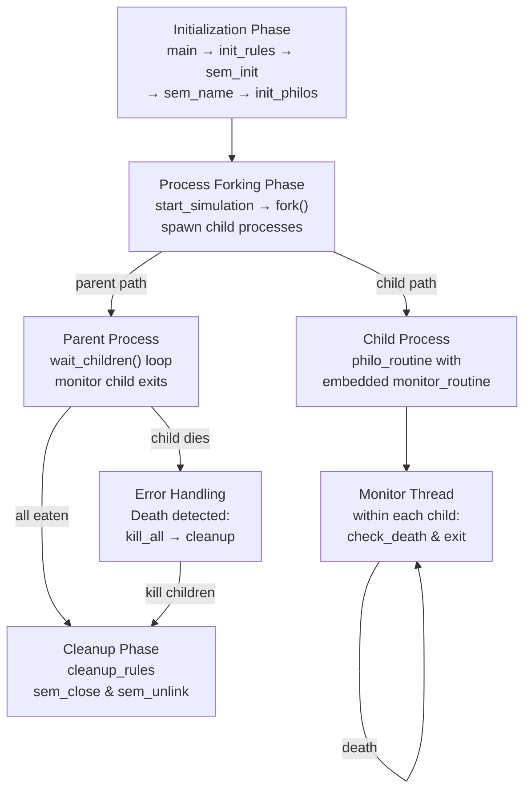

# Main Function Relationships in philo_bonus (Section Flow Diagrams)

## 1. Initialization & Setup Flow

**Details:**
- `main` initializes rules and philosophers using semaphores instead of mutexes
- `init_rules` calls `sem_init_bonus` to create named semaphores and `sem_name_bonus` to generate semaphore names
- Semaphores are used for inter-process synchronization (different from mandatory part which uses threads)
- Errors trigger full cleanup via `cleanup_rules`
- Usage errors display help via `print_usage`

---

## 2. Process Management & Monitoring Flow

**Details:**
- `start_simulation` forks child processes instead of creating threads (uses `fork()`)
- Each child process runs `philo_routine` with its own `monitor_routine` thread
- Parent process calls `wait_children` to monitor child exit statuses
- `kill_all` terminates remaining children if one dies
- Uses inter-process communication via named semaphores
- Process-based model provides better isolation than thread-based

---

## 3. Philosopher Routine Flow

**Details:**
- `philo_routine` runs in child process and manages the eat-sleep-think cycle
- `setup_child_philo` initializes philosopher with meal mutex and spawns monitor thread
- `take_forks` acquires semaphores for fork access
- `eat` updates meal time, increments meal count, and sleeps
- `philo_sleep` and `philo_think` are explicit phases with optimized think time
- `release_forks` releases semaphores after eating
- Each philosopher has its own monitor thread within the child process
- `print_state` logs state changes with semaphore-protected printing

---

## 4. Utility, Error & Process Management Flow

**Details:**
- `get_time_ms()` provides current time in milliseconds for meal tracking
- `ft_usleep()` sleeps with microsecond precision
- `print_state()` outputs philosopher state changes with semaphore protection
- `sem_wait()` acquires semaphores for fork/print access
- `sem_post()` releases semaphores after access
- `print_error()` logs errors to stderr
- `error_exit()` returns error code
- Semaphores replace mutex operations in the bonus version

---

## 5. Complete Execution Flow (Process-Based)

**Details:**
- **Initialization Phase:** Create named semaphores for inter-process synchronization
- **Process Forking:** Create child processes instead of threads (each philosopher is a separate process)
- **Parent Process:** Monitors all child processes with `wait_children()` loop
- **Child Process:** Runs `philo_routine` with embedded `monitor_routine` thread
- **Monitor Thread:** Each child process has its own monitor thread to check for starvation
- **Error Handling:** If any child dies, parent kills all remaining children immediately
- **Cleanup Phase:** Close and unlink all named semaphores, free allocated memory
- **Key Difference:** Process-based model (bonus) vs thread-based (mandatory) provides better isolation and separate memory spaces
