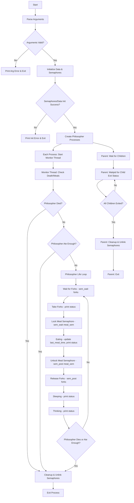

```mermaid
flowchart TD
    A[Start] --> B[Parse Arguments]
    B --> B1{Arguments Valid?}
    B1 -- No --> E1[Print Arg Error & Exit]
    B1 -- Yes --> C[Initialize Data & Semaphores]
    C --> C1{Semaphores/Data Init Success?}
    C1 -- No --> E[Print Init Error & Exit]
    C1 -- Yes --> F[Create Philosopher Processes]
    F --> G[Each Process: Start Monitor Thread]
    G --> MT[Monitor Thread: Check Death/Meals]
    MT --> MT1{Philosopher Died?}
    MT1 -- Yes --> J[Signal Stop & Cleanup]
    MT1 -- No --> MT2{Philosopher Ate Enough?}
    MT2 -- Yes --> J[Signal Stop & Cleanup]
    MT2 -- No --> X[Philosopher Life Loop]
    X --> H1[Wait for Forks - sem_wait forks]
    H1 --> H2[Take Forks - print status]
    H2 --> H3[Lock Meal Semaphore - sem_wait meal_sem]
    H3 --> H4[Eating - update last_meal_time, print status]
    H4 --> H5[Unlock Meal Semaphore - sem_post meal_sem]
    H5 --> H6[Release Forks - sem_post forks]
    H6 --> H7[Sleeping - print status]
    H7 --> H8[Thinking - print status]
    H8 --> I{Philosopher Dies or Ate Enough?}
    I -- No --> H1
    I -- Yes --> J[Cleanup & Unlink Semaphores]
    J --> K[Exit Process]
    F --> L[Parent: Wait for Children]
    L --> L1[Parent: Waitpid for Child Exit Status]
    L1 --> L2{All Children Exited?}
    L2 -- No --> L1
    L2 -- Yes --> M[Parent: Cleanup & Unlink Semaphores]
    M --> N[Parent: Exit]
```
