# Philosophers Project - Data Flow Diagram

## Overview

This document visualizes the complete data flow of the Philosophers project, showing how command-line arguments flow through parsing, initialization, synchronization, simulation, and cleanup stages in both mandatory (pthread) and bonus (semaphore) implementations.

## Data Flow Architecture

```mermaid
flowchart TD
    A["📥 Input: Command Line Args<br/>argc, argv"] -->|args| B["🔍 Parse Arguments<br/>validate_args<br/>parse_and_set_timings<br/>parse_must_eat"]
    
    B -->|t_rules struct| C["⚙️ Initialize Rules<br/>init_rules<br/>init_philos"]
    
    C -->|forks/mutexes| D["🔒 Setup Synchronization<br/>Mandatory: pthread_mutex<br/>Bonus: sem_open"]
    
    D -->|rules + sync| E{"Mandatory or<br/>Bonus?"}
    
    E -->|Mandatory| F["👥 Create Threads<br/>pthread_create<br/>philo_routine"]
    E -->|Bonus| G["👥 Fork Processes<br/>fork<br/>child_process"]
    
    F -->|philosopher state| H["🔄 Mandatory Loop<br/>take_forks<br/>eat<br/>release_forks<br/>sleep<br/>think"]
    G -->|philosopher state| I["🔄 Bonus Loop<br/>take_forks<br/>eat<br/>release_forks<br/>sleep<br/>think"]
    
    H -->|last_meal, meals| J["📊 Monitor Thread<br/>check_death<br/>all_ate_enough"]
    I -->|last_meal, meals| K["📊 Monitor Thread<br/>check_death"]
    
    J -->|monitored data| X["📋 Evaluate Status<br/>check completion<br/>verify conditions"]
    K -->|monitored data| X
    
    X -->|state changes| L["🖨️ Output: Console<br/>print_state<br/>philosopher status"]
    
    X -->|stop condition| N["🛑 Stop Signal<br/>death or<br/>all ate enough"]
    
    N -->|stop flag| O["🧹 Cleanup<br/>Mandatory: destroy mutexes<br/>Bonus: sem_close/unlink<br/>free memory"]
    
    O -->|exit| P["✅ Program Exit<br/>Return Code"]
```



## Key Data Structures

### t_rules Structure

```c
typedef struct s_rules
{
    int             philo_count;     // Number of philosophers
    time_ms         time_to_die;     // Time before philosopher dies (ms)
    time_ms         time_to_eat;     // Time to eat (ms)
    time_ms         time_to_sleep;   // Time to sleep (ms)
    int             must_eat_count;  // Meals required (optional)
    time_ms         start_time;      // Simulation start time
    int             stop;            // Stop flag (shared across all philos)
    pthread_mutex_t stop_mutex;      // Mutex protecting stop flag
}   t_rules;
```

### t_philo Structure (Mandatory)

```c
typedef struct s_philo
{
    int             id;              // Philosopher ID
    time_ms         last_meal;       // Timestamp of last meal
    int             meals_eaten;     // Count of meals eaten
    int             left_fork;       // Left fork index
    int             right_fork;      // Right fork index
    pthread_t       thread;          // Thread ID
    pthread_mutex_t *forks;          // Array of fork mutexes
    t_rules         *rules;          // Shared rules
}   t_philo;
```

### t_philo Structure (Bonus)

```c
typedef struct s_philo_bonus
{
    int             id;              // Philosopher ID
    time_ms         last_meal;       // Timestamp of last meal
    int             meals_eaten;     // Count of meals eaten
    pid_t           pid;             // Process ID
    sem_t           *forks;          // Semaphore for forks
    sem_t           *print;          // Semaphore for printing
    sem_t           *stop;           // Semaphore for stop signal
    t_rules_bonus   *rules;          // Shared rules
}   t_philo_bonus;
```

## Data Flow Stages

### Stage 1: Input & Parsing

- **Input**: Command-line arguments (number of philosophers, timers, optional meal count)
- **Processing**: `validate_args()` checks argument count and formats
- **Output**: Populated `t_rules` structure with validated values

### Stage 2: Initialization

- **Input**: `t_rules` with parsed values
- **Processing**: `init_rules()` allocates philosopher array, `init_philos()` initializes each philosopher
- **Output**: Array of `t_philo` structures with initial state (last_meal = start_time, meals_eaten = 0)

### Stage 3: Synchronization Setup

- **Mandatory**: `pthread_mutex_init()` creates fork mutexes and stop mutex
- **Bonus**: `sem_open()` creates named semaphores for forks and global semaphores
- **Output**: Initialized mutexes or semaphores ready for synchronization

### Stage 4: Simulation Start

- **Mandatory**: `pthread_create()` spawns N philosopher threads + 1 monitor thread
- **Bonus**: `fork()` creates N child processes, each runs philosopher loop
- **Output**: All entities (threads/processes) running concurrently

### Stage 5: Philosopher Main Loop

- **Take Forks**: Lock left and right fork mutexes/semaphores
- **Eat**: Update `last_meal` timestamp, increment `meals_eaten`, hold forks for `time_to_eat`
- **Release Forks**: Unlock fork synchronization primitives
- **Sleep**: Sleep for `time_to_sleep` milliseconds
- **Think**: Wait until next cycle or fork becomes available

### Stage 6: Monitoring

- **Check Death**: If (current_time - last_meal) > time_to_die, philosopher is dead
- **Check Satiation**: If all philosophers have eaten enough (bonus feature), stop condition met
- **Output**: Death or satiation message, then set stop flag

### Stage 7: Status Evaluation

- **Process**: Verify completion conditions (death detected or all ate enough)
- **Decision**: Determine if simulation should continue or stop
- **Output**: Stop signal triggers cleanup sequence

### Stage 8: Console Output

- **Synchronized Printing**: Mutex/semaphore ensures no interleaved output
- **Messages**: timestamp philosopher_id state changes (taking fork, eating, sleeping, thinking, died)
- **Output**: Timestamp + action printed to console

### Stage 9: Stop Signal

- **Trigger**: Death detected OR all philosophers satisfied (bonus)
- **Distribution**: Stop flag or semaphore set globally
- **Effect**: All philosopher loops detect stop condition and exit

### Stage 10: Cleanup & Exit

- **Mandatory**: `pthread_join()` wait for all threads, `pthread_mutex_destroy()` all mutexes, `free()` memory
- **Bonus**: `waitpid()` wait for child processes, `sem_close()/sem_unlink()` cleanup semaphores, `free()` memory
- **Exit**: Return exit code (0 for success)

## Mandatory vs Bonus Comparison

| Aspect                      | Mandatory                   | Bonus                                   |
| --------------------------- | --------------------------- | --------------------------------------- |
| Concurrency Model           | POSIX Threads (pthreads)    | Processes (fork)                        |
| Synchronization             | pthread_mutex               | Semaphores (sem\_\*)                    |
| Fork Representation         | Mutex array                 | Named semaphores                        |
| Monitor Implementation      | Separate monitor thread     | Separate monitor process                |
| Meal Requirement            | Optional (not enforced)     | Fully implemented (enforced)            |
| Inter-process Communication | Shared memory + mutexes     | Semaphores + shared memory              |
| Thread Creation             | pthread_create()            | fork() + execve (if used)               |
| Memory Management           | malloc/free (shared heap)   | malloc/free (separate heap per process) |
| Print Synchronization       | pthread_mutex_t print_mutex | sem_t print_semaphore                   |
| Philosopher Lifecycle       | Thread routine function     | Child process infinite loop             |

## Critical Data Dependencies

1. **Philosopher ID** - Used for output formatting and fork indexing
2. **Last Meal Timestamp** - Updated on every eat, checked by monitor for death
3. **Meals Eaten Counter** - Incremented after each meal, checked for satiation (bonus)
4. **Stop Flag** - Read by all philosophers, written by monitor
5. **Fork Array** - Each philosopher locks/unlocks left_fork and right_fork indices
6. **Start Time** - Reference point for all timestamp calculations

## Error Handling & Exit Codes

- **Exit 0**: Simulation completed successfully
- **Exit 1**: Parsing error or invalid arguments
- **Exit 84**: Memory allocation failure (42 School standard)
- **Exit 42**: Valgrind memory leak detected (during testing)
- **Segmentation Fault (139)**: Accessing freed memory or invalid pointer dereferencing
